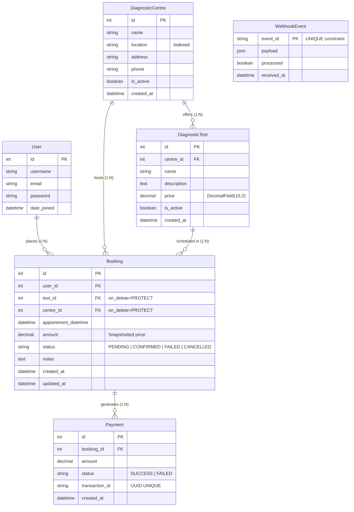
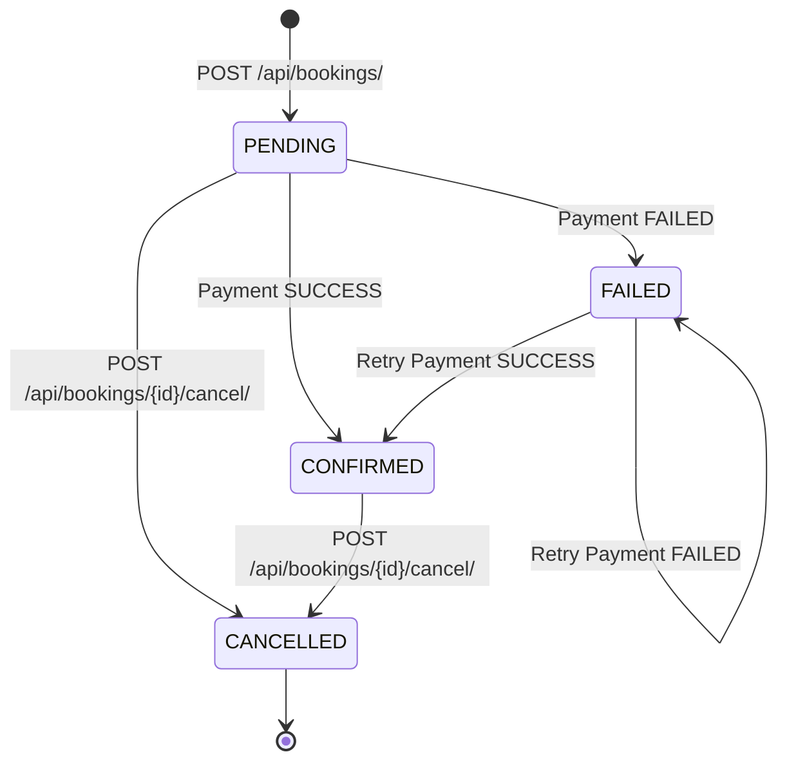

# EVE Healthcare — Diagnostic Booking Platform (Full-Stack)

A production-ready diagnostic test booking platform featuring a domain-driven **Django REST Framework** backend, an optimized **React (Vite + TypeScript + Tailwind CSS)** frontend, JWT authentication, atomic state machines, and idempotent webhook reconciliation.

---

## Table of Contents

- [1. How to Run the Project Locally](#1-how-to-run-the-project-locally)
  - [Option A: Docker Compose (Recommended)](#option-a-docker-compose-recommended)
  - [Option B: Local Development (Without Docker)](#option-b-local-development-without-docker)
- [2. Database & Schema Design](#2-database--schema-design)
  - [Entity-Relationship Diagram](#entity-relationship-diagram)
  - [Data Models Breakdown](#data-models-breakdown)
  - [Key Architectural & Schema Decisions](#key-architectural--schema-decisions)
- [3. API Endpoints & Example Requests](#3-api-endpoints--example-requests)
  - [Interactive API Documentation](#interactive-api-documentation)
  - [Endpoints Overview](#endpoints-overview)
  - [Detailed cURL Examples & Request/Response Payloads](#detailed-curl-examples--requestresponse-payloads)
- [4. Booking & Payment State Machine](#4-booking--payment-state-machine)
- [5. Important Assumptions Made](#5-important-assumptions-made)
- [6. Running Tests & Test Coverage](#6-running-tests--test-coverage)
- [7. What I Would Improve With More Time](#7-what-i-would-improve-with-more-time)
- [8. Repository Structure](#8-repository-structure)

---

## 1. How to Run the Project Locally

### Prerequisites
- **Docker & Docker Compose** (for Option A)
- **Python 3.11+** and **Node.js 18+** / **npm 9+** (for Option B)

---

### Option A: Docker Compose (Recommended)

Spins up the full multi-tier architecture (**Django backend + PostgreSQL 15 database + Auto-migrations + Auto-seed data**):

```bash
# 1. Clone repository
git clone <repo-url>
cd diagnostic-booking-service

# 2. Setup environment file
cp .env.example .env

# 3. Build and launch services
docker-compose up --build
```

The services will be available at:
- **Backend API & Swagger Docs**: `http://localhost:8000/api/docs/`
- **Django Admin**: `http://localhost:8000/admin/`

To start the React frontend:
```bash
cd frontend
npm install
npm run dev
```
- **Frontend Web Application**: `http://localhost:5173/`

---

### Option B: Local Development (Without Docker)

#### Step 1: Backend Setup (Django + DRF)

```bash
# In project root
# 1. Create and activate virtual environment
python -m venv .venv

# On Windows (PowerShell):
.venv\Scripts\Activate.ps1
# On Linux/macOS:
# source .venv/bin/activate

# 2. Install dependencies (uses requirements-local.txt for SQLite local dev)
pip install -r requirements-local.txt

# 3. Run database migrations
$env:USE_SQLITE="1"   # On Linux/macOS: export USE_SQLITE=1
python manage.py migrate

# 4. Populate sample diagnostic centres & tests
python manage.py seed_data

# 5. Start the backend server
python manage.py runserver 127.0.0.1:8000
```

#### Step 2: Frontend Setup (React + Vite + TypeScript)

```bash
# Open a new terminal in project root
cd frontend

# 1. Install dependencies
npm install

# 2. Start Vite development server
npm run dev
```

The frontend will run on **`http://localhost:5173/`** with instant Hot Module Replacement (HMR) and connects to `http://127.0.0.1:8000/`.

---

## 2. Database & Schema Design

### Entity-Relationship Diagram



### Data Models Breakdown

| Model | Table | Purpose & Key Fields |
|---|---|---|
| `User` | `auth_user` | Django built-in user model supporting hashed passwords and JWT token generation. |
| `DiagnosticCentre` | `centres_diagnosticcentre` | Physical diagnostic healthcare facility (`name`, `location`, `address`, `phone`, `is_active`). Indexed on `location`. |
| `DiagnosticTest` | `centres_diagnostictest` | Individual diagnostic tests offered by a centre (`centre`, `name`, `price`, `description`, `is_active`). Uses `DecimalField(max_digits=10, decimal_places=2)`. |
| `Booking` | `bookings_booking` | Core booking transaction. Foreign keys to `test` and `centre` use `on_delete=models.PROTECT`. Stores snapshotted `amount` and status enum. Indexed on `[user, status]` and `[status]`. |
| `Payment` | `payments_payment` | Append-only audit log of payment attempts (`booking`, `amount`, `status`, `transaction_id`, `created_at`). |
| `WebhookEvent` | `payments_webhookevent` | Enforces idempotency via `event_id VARCHAR(100) UNIQUE`. Stores raw JSON payload and processing status. |

---

### Key Architectural & Schema Decisions

1. **Separation of Booking and Payment Lifecycles**:
   - A `Booking` is **not** a payment record; it has a status that is derived from payment events.
   - Multiple `Payment` rows can link to a single `Booking` (supporting retries on failed payments).
   - The payment ledger is strictly append-only.

2. **Server-Side Price Snapshotting**:
   - `Booking.amount` is permanently snapshotted from `test.price` at the instant the booking is created.
   - If the diagnostic centre updates test prices in the future, historic booking records and financial receipts remain accurate. Client-submitted prices are discarded.

3. **`on_delete=models.PROTECT` on Critical Foreign Keys**:
   - Deleting a centre or test that has historic bookings is blocked at the database level to prevent catastrophic cascading deletes.

4. **Database-Enforced Webhook Idempotency**:
   - `WebhookEvent.event_id` has a unique database constraint.
   - Processing is enclosed inside `transaction.atomic()`. On duplicate webhook delivery, `get_or_create(event_id=...)` returns early (`200 OK`) with zero duplicate payment rows created.

5. **Race Condition Defense with `select_for_update()`**:
   - Concurrent webhook callbacks or payment simulation requests obtain a row-level lock (`select_for_update()`) on the `Booking` record to serialize state machine transitions.

---

## 3. API Endpoints & Example Requests

### Interactive API Documentation
- **Swagger UI**: [http://127.0.0.1:8000/api/docs/](http://127.0.0.1:8000/api/docs/)
- **OpenAPI 3.0 Schema**: [http://127.0.0.1:8000/api/schema/](http://127.0.0.1:8000/api/schema/)

---

### Endpoints Overview

| Method | Endpoint | Auth | Description |
|---|---|---|---|
| `POST` | `/api/auth/signup/` | None | Register a new patient/user |
| `POST` | `/api/auth/login/` | None | Authenticate and obtain JWT `access` & `refresh` tokens |
| `POST` | `/api/auth/token/refresh/` | None | Refresh an expired access token |
| `GET` | `/api/centres/` | Optional | List diagnostic centres (filter: `?location=`, `?is_active=`) |
| `GET` | `/api/centres/{id}/` | Optional | Retrieve centre details with nested test catalog |
| `GET` | `/api/tests/` | Optional | List diagnostic tests (filter: `?centre=`, `?search=`, `?min_price=`, `?max_price=`) |
| `POST` | `/api/bookings/` | Required | Create a new booking in `PENDING` status |
| `GET` | `/api/bookings/` | Required | List authenticated user's bookings (filter: `?status=`) |
| `GET` | `/api/bookings/{id}/` | Required (Owner) | Retrieve single booking details (403 if not owner) |
| `POST` | `/api/bookings/{id}/cancel/` | Required (Owner) | Cancel a `PENDING` or `CONFIRMED` booking |
| `POST` | `/api/payments/` | Required (Owner) | Simulate payment for `booking_id` |
| `POST` | `/api/payments/webhook/` | None (Public) | Idempotent webhook receiver (`event_id`, `booking_id`, `status`) |

---

### Detailed cURL Examples & Request/Response Payloads

#### 1. User Signup
```bash
curl -X POST http://127.0.0.1:8000/api/auth/signup/ \
  -H "Content-Type: application/json" \
  -d '{
    "username": "sarah_connor",
    "email": "sarah@example.com",
    "password": "SecurePassword123!",
    "confirm_password": "SecurePassword123!"
  }'
```
**Response (`201 Created`):**
```json
{
  "id": 1,
  "username": "sarah_connor",
  "email": "sarah@example.com",
  "date_joined": "2026-09-25T14:00:00Z"
}
```

---

#### 2. User Login (Get JWT Token)
```bash
curl -X POST http://127.0.0.1:8000/api/auth/login/ \
  -H "Content-Type: application/json" \
  -d '{
    "username": "sarah_connor",
    "password": "SecurePassword123!"
  }'
```
**Response (`200 OK`):**
```json
{
  "access": "eyJhbGciOiJIUzI1NiIsIn...",
  "refresh": "eyJhbGciOiJIUzI1NiIsIn..."
}
```

---

#### 3. Browse Diagnostic Tests Catalog
```bash
curl -X GET "http://127.0.0.1:8000/api/tests/?search=CBC"
```
**Response (`200 OK`):**
```json
{
  "count": 1,
  "next": null,
  "previous": null,
  "results": [
    {
      "id": 1,
      "name": "Complete Blood Count (CBC)",
      "description": "Comprehensive blood panel",
      "price": "750.00",
      "is_active": true,
      "centre": 1
    }
  ]
}
```

---

#### 4. Create a Booking
```bash
curl -X POST http://127.0.0.1:8000/api/bookings/ \
  -H "Authorization: Bearer <ACCESS_TOKEN>" \
  -H "Content-Type: application/json" \
  -d '{
    "test": 1,
    "centre": 1,
    "appointment_datetime": "2027-01-15T09:30:00Z",
    "notes": "Fasting 10 hours beforehand"
  }'
```
**Response (`201 Created`):**
```json
{
  "id": 1,
  "test": {
    "id": 1,
    "name": "Complete Blood Count (CBC)",
    "price": "750.00"
  },
  "centre": {
    "id": 1,
    "name": "Apollo Diagnostics",
    "location": "Delhi"
  },
  "appointment_datetime": "2027-01-15T09:30:00Z",
  "amount": "750.00",
  "status": "PENDING",
  "status_display": "Pending",
  "notes": "Fasting 10 hours beforehand",
  "created_at": "2026-09-25T14:15:00Z",
  "updated_at": "2026-09-25T14:15:00Z"
}
```

---

#### 5. Simulate Payment for a Booking
```bash
curl -X POST http://127.0.0.1:8000/api/payments/ \
  -H "Authorization: Bearer <ACCESS_TOKEN>" \
  -H "Content-Type: application/json" \
  -d '{
    "booking_id": 1
  }'
```
**Response (`201 Created`):**
```json
{
  "payment": {
    "id": 1,
    "booking": 1,
    "amount": "750.00",
    "status": "SUCCESS",
    "transaction_id": "a9c785b2-38d5-45be-9bc0-880ea7b03657",
    "created_at": "2026-09-25T14:16:00Z"
  },
  "booking": {
    "id": 1,
    "status": "CONFIRMED",
    "status_display": "Confirmed",
    "amount": "750.00"
  }
}
```

---

#### 6. Send Idempotent Webhook Callback
```bash
# First delivery
curl -X POST http://127.0.0.1:8000/api/payments/webhook/ \
  -H "Content-Type: application/json" \
  -d '{
    "event_id": "evt_9988aabbcc11",
    "booking_id": 1,
    "status": "SUCCESS"
  }'
```
**Response (`200 OK`):**
```json
{
  "message": "Booking #1 status updated to CONFIRMED.",
  "event_id": "evt_9988aabbcc11",
  "payment": {
    "id": 2,
    "booking": 1,
    "amount": "750.00",
    "status": "SUCCESS",
    "transaction_id": "d0e1f2a3-b4c5-6789-0123-456789abcdef"
  },
  "booking": {
    "id": 1,
    "status": "CONFIRMED"
  }
}
```

**Duplicate Delivery (Same `event_id`):**
```bash
curl -X POST http://127.0.0.1:8000/api/payments/webhook/ \
  -H "Content-Type: application/json" \
  -d '{
    "event_id": "evt_9988aabbcc11",
    "booking_id": 1,
    "status": "SUCCESS"
  }'
```
**Response (`200 OK` with zero side effects):**
```json
{
  "message": "Duplicate event. Already processed.",
  "event_id": "evt_9988aabbcc11"
}
```

---

#### 7. Cancel a Booking
```bash
curl -X POST http://127.0.0.1:8000/api/bookings/1/cancel/ \
  -H "Authorization: Bearer <ACCESS_TOKEN>"
```
**Response (`200 OK`):**
```json
{
  "id": 1,
  "status": "CANCELLED",
  "status_display": "Cancelled",
  "amount": "750.00"
}
```

---

## 4. Booking & Payment State Machine



### State Machine Transition Rules

| Initial State | Event / Trigger | Resulting State | Business Rule / Validation |
|---|---|---|---|
| None | `POST /api/bookings/` | `PENDING` | Validates appointment is in future & test belongs to centre. |
| `PENDING` | Payment `SUCCESS` | `CONFIRMED` | Confirms appointment slot. |
| `PENDING` | Payment `FAILED` | `FAILED` | Marks payment failure; preserves booking for retry. |
| `FAILED` | Retry Payment `SUCCESS` | `CONFIRMED` | Retries are permitted on `FAILED` bookings. |
| `FAILED` | Retry Payment `FAILED` | `FAILED` | Creates another `Payment` record with status `FAILED`. |
| `PENDING` | `POST /api/bookings/{id}/cancel/` | `CANCELLED` | Owner can cancel unpaid booking. |
| `CONFIRMED` | `POST /api/bookings/{id}/cancel/` | `CANCELLED` | Owner can cancel confirmed appointment. |
| `CANCELLED` | Payment Attempt | `409 Conflict` | Cancelled bookings cannot accept payments. |
| `CONFIRMED` | Payment Attempt | `409 Conflict` | Already confirmed bookings cannot be re-paid. |
| Any | Duplicate Webhook `event_id` | No state change | Returns `200 OK` immediately (idempotent short-circuit). |

---

## 5. Important Assumptions Made

1. **Separation of Concerns**:
   A `Booking` entity tracks the medical appointment reservation, while `Payment` tracks financial transactions. A booking status is derived from payment events.
2. **Price Snapshotting**:
   Medical diagnostic prices fluctuate over time. We assume historical invoices and confirmed appointments must preserve the exact price agreed upon at creation time (`Booking.amount`), regardless of catalog updates.
3. **HTTP 403 vs 404 for Authorization Violations**:
   When User A requests User B's booking by ID, the API returns **`403 Forbidden`** (not `404 Not Found`). In authenticated patient portals, obscurity via 404 is confusing; explicit permission denial (403) clearly communicates access boundaries.
4. **Cancellation Policy**:
   Both `PENDING` (unpaid) and `CONFIRMED` (paid) appointments may be cancelled by the owner prior to the scheduled slot. Once `CANCELLED`, the booking reaches a terminal state and cannot be paid.
5. **Retry Behavior for Failed Payments**:
   If a payment attempt fails (`FAILED`), the booking is **not** deleted or cancelled; the patient may retry the payment transaction.
6. **Webhook Authority**:
   In production, third-party payment provider webhooks (e.g. Stripe, Razorpay) are treated as the single source of truth for payment status.

---

## 6. Running Tests & Test Coverage

The project includes an end-to-end automated test suite built with **pytest**, **pytest-django**, and **factory_boy**.

### Running the Test Suite

```bash
# Run all tests
pytest

# Run with verbose output
pytest -v --tb=short
```

### Test Suite Breakdown (41/41 Passing)

```
collected 41 items

apps/bookings/tests/test_booking_create.py ......                        [ 14%]
  ✓ test_create_booking_success
  ✓ test_amount_is_snapshotted_from_test_price
  ✓ test_past_appointment_rejected
  ✓ test_test_centre_mismatch_rejected
  ✓ test_unauthenticated_rejected
  ✓ test_booking_list_filtered_to_current_user

apps/bookings/tests/test_booking_permissions.py ......                   [ 29%]
  ✓ test_owner_can_retrieve
  ✓ test_other_user_gets_403
  ✓ test_unauthenticated_gets_401
  ✓ test_owner_can_cancel_pending
  ✓ test_other_user_cannot_cancel
  ✓ test_cannot_cancel_already_cancelled

apps/centres/tests/test_centres.py ....                                  [ 39%]
  ✓ test_list_centres_authenticated
  ✓ test_list_centres_unauthenticated
  ✓ test_filter_by_location
  ✓ test_centre_detail_has_tests

apps/payments/tests/test_payment_simulation.py ........                  [ 58%]
  ✓ test_successful_payment_confirms_booking
  ✓ test_failed_payment_fails_booking
  ✓ test_failed_booking_can_be_retried
  ✓ test_cancelled_booking_returns_409
  ✓ test_confirmed_booking_returns_409
  ✓ test_other_users_booking_returns_403
  ✓ test_invalid_booking_id_returns_404
  ✓ test_unauthenticated_returns_401

apps/payments/tests/test_webhook_idempotency.py .......                  [ 75%]
  ✓ test_webhook_success_confirms_booking
  ✓ test_webhook_failed_fails_booking
  ✓ test_duplicate_webhook_does_not_create_duplicate_payment (IDEMPOTENCY)
  ✓ test_different_event_ids_create_separate_payments
  ✓ test_malformed_webhook_returns_400
  ✓ test_invalid_booking_id_returns_404
  ✓ test_invalid_status_returns_400

apps/users/tests/test_login.py ....                                      [ 85%]
  ✓ test_login_success
  ✓ test_login_wrong_password
  ✓ test_login_nonexistent_user
  ✓ test_login_missing_fields

apps/users/tests/test_signup.py ......                                   [100%]
  ✓ test_signup_success
  ✓ test_signup_password_not_in_response
  ✓ test_signup_duplicate_email
  ✓ test_signup_password_mismatch
  ✓ test_signup_weak_password
  ✓ test_signup_missing_email

============================= 41 passed in 8.21s ==============================
```

---

## 7. What I Would Improve With More Time

If allotted additional engineering time, here are the architectural and feature enhancements I would prioritize for enterprise production scale:

1. **HMAC-SHA256 Webhook Signature Verification**:
   - Verify cryptographic signatures (`X-Signature` or `Stripe-Signature` headers) using a shared secret to prevent spoofed webhook injection attacks.
2. **Asynchronous Webhook & Task Processing via Celery + Redis**:
   - Decouple webhook ingress from processing: acknowledge webhook receipt in `< 50ms` and offload state transitions and third-party notifications to background Celery workers with exponential backoff retries.
3. **Rate Limiting & Abuse Prevention**:
   - Implement DRF throttling classes or Redis-backed sliding-window rate limiters on `/api/auth/login/`, `/api/auth/signup/`, and `/api/payments/` to protect against credential stuffing and brute-force attacks.
4. **Appointment Slot Concurrency & Capacity Management**:
   - Implement slot locking (e.g. maximum 5 appointments per 30-minute interval per centre) using Redis distributed locks (`Redlock`) to eliminate overbooking during peak morning hours.
5. **Multi-Channel Notification Dispatcher**:
   - Send email and SMS/WhatsApp appointment reminders and digital PDF lab reports upon booking confirmation or status changes.
6. **Soft Deletes & Audit Trails**:
   - Integrate `django-simple-history` to track all historical modifications on bookings, test catalog changes, and user access records for HIPAA/GDPR healthcare compliance.
7. **Elasticsearch / Opensearch Catalog Search**:
   - Replace SQL `icontains` filters with full-text indexing, fuzzy spelling correction, and geo-distance search for finding diagnostic centres closest to the patient's GPS coordinates.

---

## 8. Repository Structure

```
diagnostic-booking-service/
├── config/                        # Django project configuration
│   ├── settings/
│   │   ├── base.py                # Base settings (DRF, JWT, Spectacular)
│   │   ├── local.py               # Local development overrides
│   │   └── production.py          # Hardened production settings
│   ├── urls.py                    # Root URL routing + Swagger UI
│   ├── wsgi.py
│   └── asgi.py
│
├── apps/                          # Domain apps (DDD structure)
│   ├── users/                     # Authentication & User Profiles
│   │   ├── models.py
│   │   ├── serializers.py
│   │   ├── views.py
│   │   ├── urls.py
│   │   └── tests/
│   │
│   ├── centres/                   # Diagnostic Centres & Catalog
│   │   ├── models.py              # DiagnosticCentre, DiagnosticTest
│   │   ├── serializers.py
│   │   ├── views.py
│   │   ├── urls.py
│   │   ├── management/commands/
│   │   │   └── seed_data.py       # Seed script
│   │   └── tests/
│   │
│   ├── bookings/                  # Core Booking Domain
│   │   ├── models.py              # Booking, Status enum
│   │   ├── services.py            # Business logic & state transitions
│   │   ├── serializers.py
│   │   ├── views.py
│   │   ├── permissions.py         # IsBookingOwner
│   │   └── tests/
│   │
│   └── payments/                  # Payment Simulation & Webhooks
│       ├── models.py              # Payment, WebhookEvent (idempotency key)
│       ├── services.py            # simulate_payment(), process_webhook()
│       ├── serializers.py
│       ├── views.py
│       └── tests/
│
├── common/                        # Shared utilities
│   ├── exceptions.py              # Standardized error response envelope
│   ├── pagination.py              # PageNumberPagination
│   └── permissions.py
│
├── frontend/                      # React + Vite + TypeScript Frontend
│   ├── src/
│   │   ├── api/                   # Axios client & endpoints
│   │   ├── components/            # Reusable UI, Layout, Booking, Payment components
│   │   ├── context/               # AuthContext, NotificationContext (Toast)
│   │   ├── pages/                 # Home, Catalog, CentreDetail, Bookings, WebhookSandbox
│   │   ├── routes/                # Client-side router
│   │   ├── types/                 # TypeScript interfaces
│   │   └── utils/                 # Currency, date helpers
│   ├── package.json
│   ├── tailwind.config.js
│   └── vite.config.ts
│
├── Dockerfile                     # Multi-stage container definition
├── docker-compose.yml             # Postgres + Django orchestration
├── requirements.txt               # Pinned dependencies (PostgreSQL production)
├── requirements-local.txt         # Local development dependencies (SQLite)
├── pytest.ini                     # Pytest configuration
├── .env.example                   # Environment template
└── README.md                      # Comprehensive documentation
```
